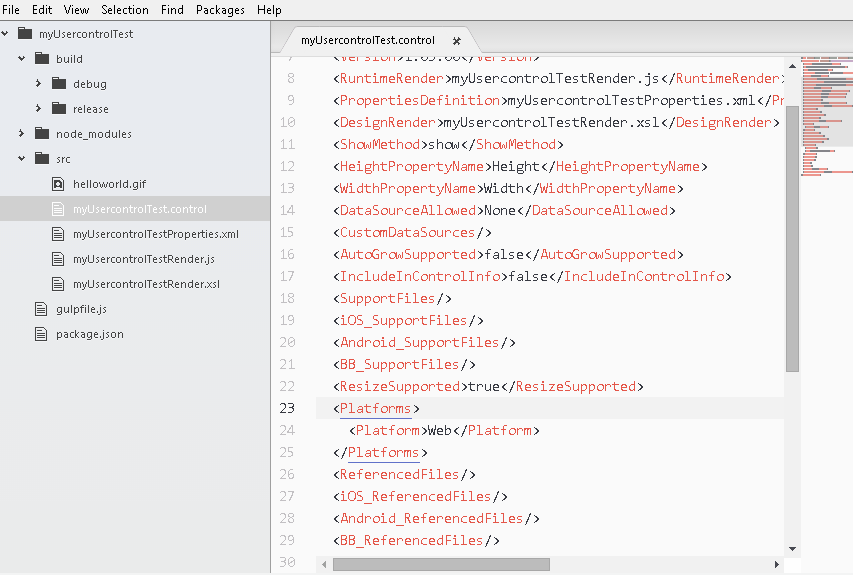

usercontrol-generator package
=============================

Genexus UserControl Generator is an Atom package that helps to create [User Controls](http://wiki.genexus.com/commwiki/servlet/wiki?5273,Category%3AUser+Controls) for GeneXus.

Table of Contents
-----------------
  * [Main Features](#features)
  * [Requirements](#requirements)
  * [Installation](#install)
  * [Using](#using)
  * [Architecture](#architecture)
  * [Contributing](#contributing)
  * [License](#license)

## Main Features
With this package you get:

* Usercontrol creation with main settings
* .control files syntax highlighting
* .control structure autocomplete
* Gulp building script

## Requirements

- [Atom](https://atom.io/)
## Installation
1. Goto File/Settings/Install
2. Search for "GeneXus Usercontrol Generator"
3. Press Install button

## Using
### Create a new usercontrol
Follow below steps to create a new usercontrol:
1. Goto Packages/GeneXus/Crete User control
2. Specify name, description, platform and other attributes and press enter
3. New control project will be opened

#### Generated Usercontrol structure
When you create a Usercontrol from this package, the below structure will be created:

* \src : Usercontrol source files
* \gulpfile.js : Gulp script for building (debug/release)
* \build\debug : Default debug build
* \build\release : Default release build

### Build process
This package uses gulp to build the user control.
You can do a debug or release build by click on the option Packages/GeneXus/Build/[Debug or Release]

You are free to modify your project gulp script by editing the gulpscript.js file.

#### Updating your testing usercontrol KB
You will find the myTestKB variable on the gulpscript file. Setting this variable, the user control will be updated in your KB when debug build run.

## Architecture
### Autocomplete
Atom uses [Autocomplete plus](https://github.com/atom/autocomplete-plus) for this feature.

Were write a specific autocomplete provider to add this feature in the control and properties file. You can check it on \lib\autocomplete\provider.js.

### Usercontrol
User control is a helper class that provides with some usercontrol features as creation, check is valid, read and write attributes an others.

This class will be used mainly for creating and building a usercontrol.

#### Creation
usercontrol-create-view is UI responsible for creating the usercontrol.

#### Build
For build process, we decided for [gulp](http://gulpjs.com/) as it is write on javascript as atom.
usercontrol-build-view is responsible for the UI and run the gulp script located on the usercontrol root path.

### Grammar association
.control files are associated automatically to xml files using [grammars](https://atom.io/docs/api/v1.8.0/Grammar). This happens on the usercontrol activation (usercontrol-generator.activate()).

### Others
base-form.js is an abstract form helper to build our UI.

utils.js is a class with some useful functions.

## Contributing
This project adheres to the Contributor Covenant [code of conduct](CODE_OF_CONDUCT.md).
By participating, you are expected to uphold this code. Please report unacceptable behavior to jdiana@genexus.com.

## License
Copyright (c) 2016 Genexus

Permission is hereby granted, free of charge, to any person obtaining
a copy of this software and associated documentation files (the
"Software"), to deal in the Software without restriction, including
without limitation the rights to use, copy, modify, merge, publish,
distribute, sublicense, and/or sell copies of the Software, and to
permit persons to whom the Software is furnished to do so, subject to
the following conditions:

The above copyright notice and this permission notice shall be
included in all copies or substantial portions of the Software.

THE SOFTWARE IS PROVIDED "AS IS", WITHOUT WARRANTY OF ANY KIND,
EXPRESS OR IMPLIED, INCLUDING BUT NOT LIMITED TO THE WARRANTIES OF
MERCHANTABILITY, FITNESS FOR A PARTICULAR PURPOSE AND
NONINFRINGEMENT. IN NO EVENT SHALL THE AUTHORS OR COPYRIGHT HOLDERS BE
LIABLE FOR ANY CLAIM, DAMAGES OR OTHER LIABILITY, WHETHER IN AN ACTION
OF CONTRACT, TORT OR OTHERWISE, ARISING FROM, OUT OF OR IN CONNECTION
WITH THE SOFTWARE OR THE USE OR OTHER DEALINGS IN THE SOFTWARE.
